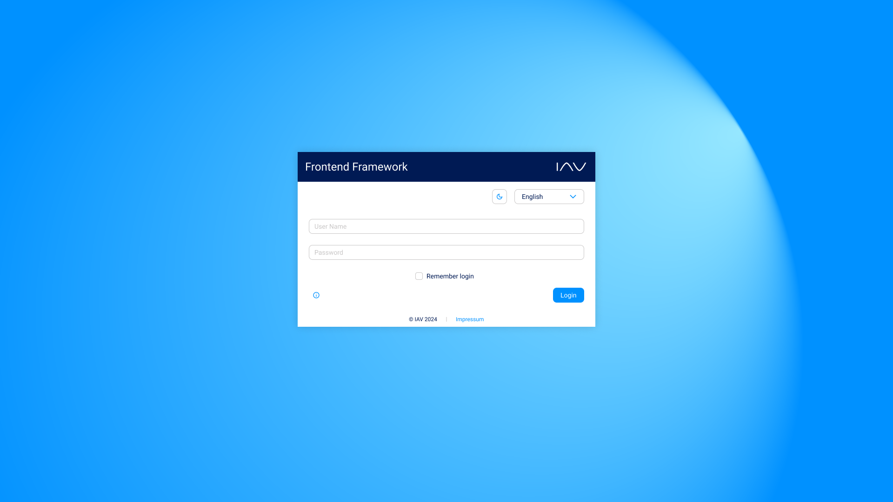

<!--
 Copyright © 2025 IAV GmbH Ingenieurgesellschaft Auto und Verkehr, All Rights Reserved.

 Licensed under the Apache License, Version 2.0 (the "License");
 you may not use this file except in compliance with the License.
 You may obtain a copy of the License at

 http://www.apache.org/licenses/LICENSE-2.0

 Unless required by applicable law or agreed to in writing, software
 distributed under the License is distributed on an "AS IS" BASIS,
 WITHOUT WARRANTIES OR CONDITIONS OF ANY KIND, either express or implied.
 See the License for the specific language governing permissions and
 limitations under the License.

 SPDX-License-Identifier: Apache-2.0
-->

# IAVFrontendFramework

## About the Project

The IAV Frontend Framework is designed to simplify the development of modern, scalable, and reusable frontend
applications. It provides developers with a solid foundation of consistent, pre-built components and flexible
customization options, significantly speeding up the development process. Whether you're just starting out or are an
experienced developer, this framework is built to offer a seamless and efficient development experience.

## Getting Started

To get started with the framework, please visit
our [GitHub Pages site](https://iavofficial.github.io/IAVFrontendFramework/) where you will find all the relevant
information.

## Feedback and Ideas

You have a new idea, want to provide feedback to an ongoing discussion or just have questions? Then, please open a new
thread in the [discussions section](https://github.com/iavofficial/IAVFrontendFramework/discussions). Further
information about the section can be found [here](https://github.com/iavofficial/IAVFrontendFramework/discussions/1).

## Layout

Here's a quick look of an example of the IAV Frontend Framework:

## License

This project is licensed under the **Apache-2.0** license. The full license text is included in
the [root of the repository](./LICENSE).

## Contributing

Contributions are welcome! Please read the [contributing guidelines](./CONTRIBUTING.md) before submitting a pull
request.
