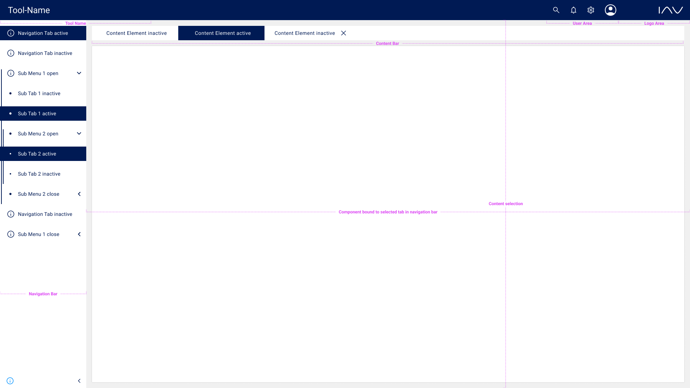

# IAVFrontendFramework

## About the Project

For information about the project see [GitHub Pages](https://iavofficial.github.io/IAVFrontendFramework/).

You have a new idea, want to provide feedback to an ongoing discussion or just have questions? Then, please open a new
thread in the [discussions section](https://github.com/iavofficial/IAVFrontendFramework/discussions). Further
information about the section can be found [here](https://github.com/iavofficial/IAVFrontendFramework/discussions/1).

## Description

The IAV Frontend Framework was created to address common challenges in developing multiple IAV frontend applications:

- **Lack of Maintainability**: Imagine IAV introduces a new style guide. All three applications would need to be
  updated, which is labor-intensive and costly. A centralized framework solves this problem by allowing for centralized
  maintenance and distribution.

- **Lack of Extendability**: Want to add a new feature that might be of interest to all IAV frontend applications?
  Without a mechanism for centralized distribution, you'd have to implement it multiple times. The framework allows for
  the central implementation and distribution of new features across all applications.

- **Higher Risk of Faults**: Implementing the same functionality multiple times increases the risk of introducing
  errors. By implementing a feature once and distributing it centrally, you minimize this risk.

- **Lower Developer Experience**: It's not enjoyable to repeatedly implement the same functionality across multiple
  projects. The framework enhances developer experience by reducing redundant work.

For more information, please refer to the [documentation](https://iavofficial.github.io/IAVFrontendFramework/).

## Layout

Here's a quick look of an example of the IAV Frontend Framework:

## License

This project is licensed under the **Apache-2.0** license. The full license text is included in
the [root of the repository](./LICENSE).

## Contributing

Contributions are welcome! Please read the [contributing guidelines](./CONTRIBUTING.md) before submitting a pull
request.
